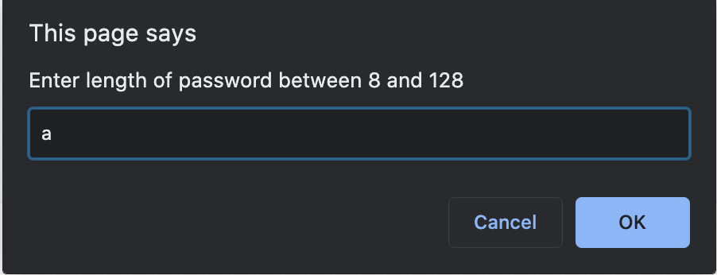
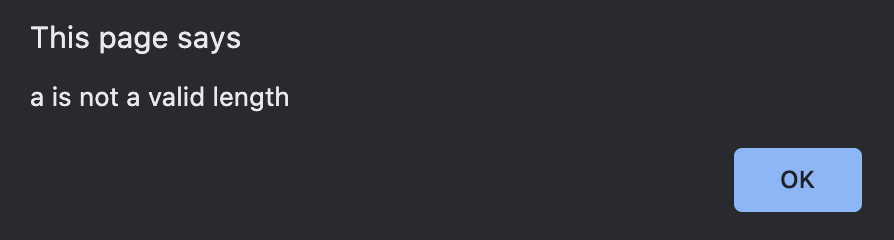
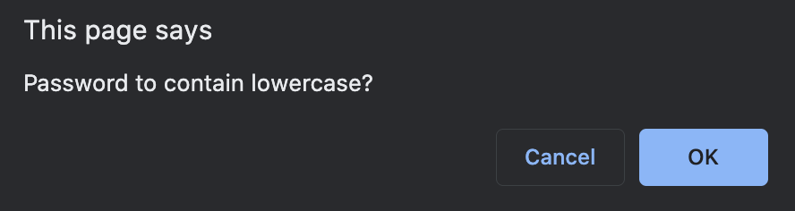
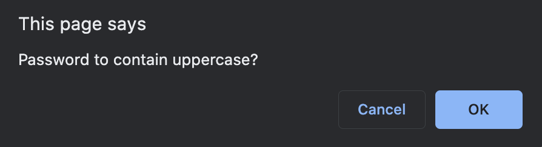
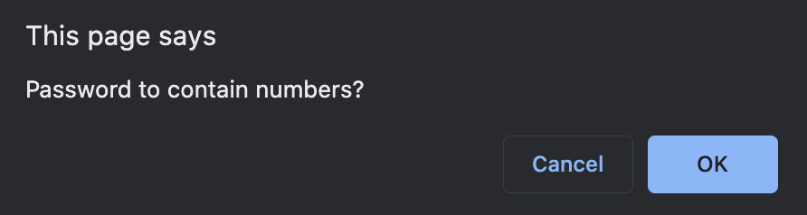
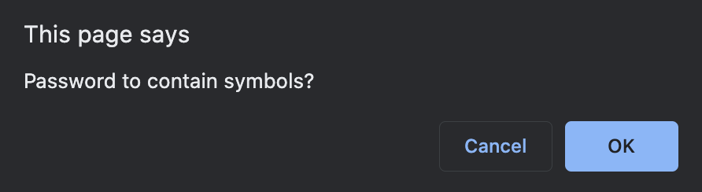
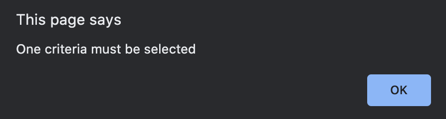
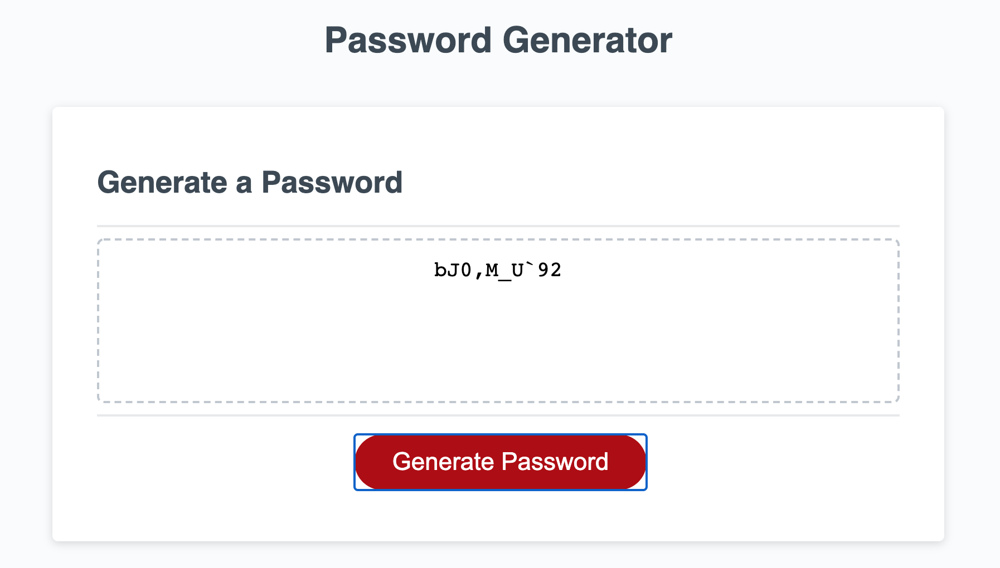

# Password Generator

Generates a password based on user's input, such as length of password and if the password is to contain lowercase, uppercase, symbols or number.

This generator also validates that user's input must be an integer between 8 to 128 (inclusive) and that one password criteria is selected. 

## Application URL

## Screenshots

The following images show the password generator's functionalities and validations:
 
 ### The prompt that is shown when user clicks "Generate Password"

### The message shown when user enters an invalid input for length

### If length input is successful, this question will be asked

### Another criteria that user can choose to have in s/he password

### Another criteria that user can choose to have in s/he password

### Another criteria that user can choose to have in s/he password

### This message is shown if user selects "Cancel" for each of the criteria asked

### A password that satisfies all user's criteria is generated and is displayed in the text area
